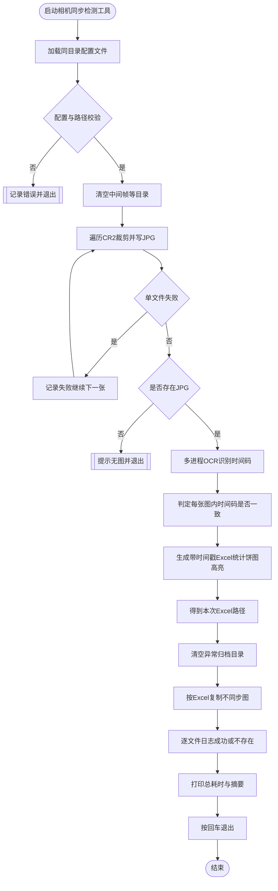
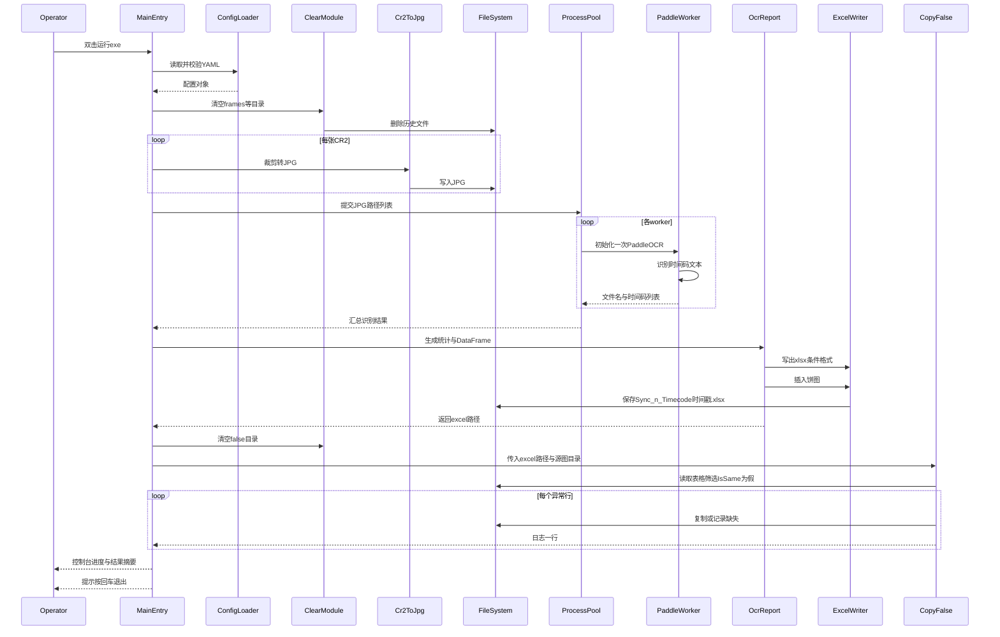

# 相机同步检测工具 — 需求说明与设计文档

**文档归档（权威路径）**：`D:\新包验证\AI测试应用\Cursor_document\相机同步检测工具_需求与设计.md`

本文档汇总**项目目标**、**按优先级排序的需求**、**开发计划**，并提供**设计流程图**与**软件运行时序图**（Mermaid，可在 VS Code / Cursor 预览或导出）。

---

## 1. 项目背景与目标

将现有 4 个 Python 脚本（`Cr2 Cut Into Jpg.py`、`CS8K_n_Timecode.py`、`Copy_False.py` 及依赖 `Clear_folder.py`）**重构、优化并打包**为 Windows 独立可执行程序 **`相机同步检测工具.exe`**：目标机器**无需安装 Python 及第三方库**，双击即可运行。

**核心用途**：检测相机拍照的同步画面**时间码是否帧级一致**（单张 JPG 内多处 OCR 到的时间码是否完全相同），并输出带统计与高亮的 Excel 报告，自动归档不同步样本图。

---

## 2. 需求说明（按优先级）

### P1 — 基础功能保留（全流程自动化）

打包后的 exe 须能完整执行原有端到端流程，**全程无需人工干预**：

1. **清空历史目录**（如中间帧目录、异常图目录等，与配置一致）。
2. **批量读取 CR2**，按配置**裁剪**指定区域并导出 **JPG**。
3. **OCR 识别** JPG 中的时间码（形如 `00:MM:SS:FF` 等，与现有正则一致）。
4. **校验单图内**识别出的多条时间码是否**完全一致**（判定同步 / 不同步）。
5. **生成 Excel 报告**：包含同步率统计、对异常行**红色高亮**、插入**同步率饼图**。
6. **自动复制**判定为不同步的图片到指定文件夹。

### P2 — 代码优化

- **配置外置**：路径、裁剪坐标、OCR 相关参数等**不得硬编码**在业务脚本中；修改参数**无需改核心逻辑**（推荐 exe 同目录 **YAML + 中文注释**，亦可在计划中保留内置默认模板）。
- **结构整理**：合并冗余函数，模块划分清晰（清空 / 转图 / OCR 报告 / 复制异常）。
- **健壮性**：文件不存在、OCR 失败、路径非法等场景**捕获异常并记录日志**，避免 exe **无声崩溃**。
- **性能**：多进程执行 OCR 时，避免 Windows 下 **PaddleOCR 在每个子进程重复全量初始化**带来的冗余；合理设置 `max_workers`，在稳定性与速度间平衡。

### P3 — 配置文件与分发

- **配置文件与 exe 分离**：与可执行文件同目录维护，修改后**无需重新打包**。
- **注释清晰**：每个参数用途明确，便于现场同事维护。

### P4 — 打包与交付形态

- 使用 **PyInstaller**，输出**单个**独立 **exe**，命名为 **`相机同步检测工具.exe`**。
- 打入脚本逻辑、`Clear_folder` 等价实现及所有运行时依赖，**目标机零安装**。
- **保留控制台窗口**，输出进度与错误，避免「无响应无感知」。
- 在可行范围内 **减小体积**（排除无用子模块、合理使用 spec / hooks）；说明：PaddleOCR + CV 等栈可能仍导致**较大**体积，需在文档与验收预期中写明。

### P5 — 细节体验

- 运行结束后提示 **「按回车键退出」**，防止窗口瞬间关闭看不到日志。
- Excel 报告文件名**带时间戳**，避免覆盖历史报告。
- 复制异常图时打印明确日志：**复制成功** / **源文件不存在**。
- **统一 UTF-8 编码**，降低中文乱码概率（源码、配置、日志一致）。

---

## 3. 开发计划摘要

| 阶段 | 内容 |
|------|------|
| 配置 | 定义 `camera_sync_config.yaml`（或等价方案）：路径、crop、ocr、excel、runtime；启动时校验；缺失则写出默认模板 |
| 模块化 | `main.py` 串联：`clear` → `cr2_to_jpg` → `ocr_report` → `copy_false`；`ocr_report` **返回本次 Excel 绝对路径**给复制步骤 |
| OCR 进程模型 | `ProcessPoolExecutor(initializer=...)` 每 worker **仅初始化一次** PaddleOCR；`max_workers` 可配置 |
| Excel | 保留汇总行、条件格式、饼图；修正红色高亮逻辑（跳过 Summary 行，按 `Is Same` 判定） |
| 打包 | `camera_sync.spec`：`--onefile --console`，产物名 **`相机同步检测工具.exe`**；收集 paddleocr/cv2/rawpy 等隐藏依赖 |
| 验收 | 在无 Python 的 Windows 上双击：全流程跑通，生成带时间戳 xlsx，`false` 目录归档异常图，控制台可读完日志并按回车退出 |

详细技术要点（现状问题、目录结构、风险列表）见 Cursor Plan：`相机同步检测_exe` 计划条目。

---

## 4. 设计流程图（总体业务流程）

下图描述从启动到退出的**业务步骤**及分支（配置错误、0 张图等可在实现中细化）。

---

## 5. 软件运行时序图（模块交互）

下图描述**单次运行**中主程序与各子模块、外部资源之间的交互顺序（实现时类名/函数名可局部调整，语义一致即可）。

---

## 6. 文档维护

- **需求变更**：在本文档第 2 节更新条目，并同步实施清单。
- **图表变更**：若流水线增加步骤（例如跳过已存在 JPG、增量 OCR），请同步更新第 4、5 节 Mermaid 源码。
- **归档位置**：权威 Markdown 副本统一存放于 `D:\新包验证\AI测试应用\Cursor_document`。

---

## 7. 测试用例与自动化测试（pytest）

### 7.1 原则

- **快速默认**：日常自动化以 **mock** 代替真实 PaddleOCR / rawpy / CR2，避免下载模型与依赖相机素材。
- **可拆函数**：时间码解析、是否同步判定、Excel 汇总行与条件格式规则等应可 **脱离硬件** 单测。
- **慢测可选**：真实 OCR 或全链路集成使用 `pytest -m slow` 或 `not slow` 区分。

### 7.2 用例格式与明细位置

详细用例以 **总表**形式维护，列含：**用例ID、用例名称、测试类型、前置条件/输入、操作步骤、预期结果、实际结果、备注**（与联调用例表一致，可复制至 Excel）。见 **[相机同步检测工具_测试用例与自动化.md](./相机同步检测工具_测试用例与自动化.md)** 第 **3.2** 节；**3.3** 为 PRD 优先级映射摘要。

### 7.3 自动化脚本（实现阶段交付）

- 目录：`tests/`，入口配置：`pytest.ini`（markers：`slow`、`integration`）。
- Windows 一键：`run_tests.bat` 执行 `pytest -q -m "not slow"`。
- 开发依赖：`requirements-dev.txt`（`pytest`、可选 `pytest-cov`、`freezegun`）。

**专项文档**：完整用例表、mock 说明与交付清单见同目录 [相机同步检测工具_测试用例与自动化.md](./相机同步检测工具_测试用例与自动化.md)。

---

*文档版本：与「相机同步检测 exe」开发计划同步维护。*
